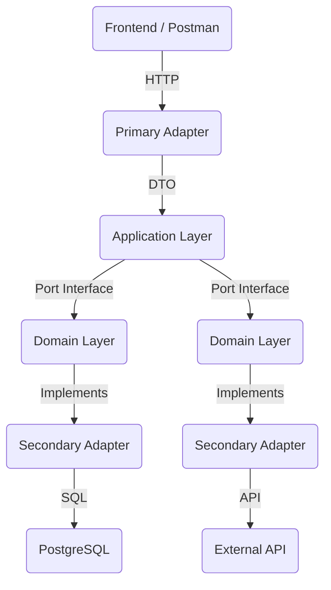

# Hexa Payment Onboarding

A complete Full-Stack Payment Onboarding application built with **React (Frontend)** and **NestJS (Backend)**, designed to demonstrate **Hexagonal Architecture**, **Railway Oriented Programming (ROP)**, and **AWS Cloud Deployment**.

This project implements a credit card payment flow integrated with an **External Payment Gateway**.

---

## Live Demo

-   **Frontend (AWS CloudFront)**: [https://d3nopilcv164t0.cloudfront.net/](https://d3nopilcv164t0.cloudfront.net/)
-   **Backend (AWS EC2)**: [http://100.53.137.249:3000/api](http://100.53.137.249:3000/api)
-   **Database (AWS RDS)**: PostgreSQL hosted on AWS RDS.

> [!NOTE]
> **HTTP vs HTTPS**: This project is deployed using **HTTP** to avoid the additional costs associated with purchasing a custom domain name and configuring an SSL certificate via AWS Certificate Manager (which requires a domain). For a production environment, HTTPS/SSL is mandatory and would be implemented using AWS CloudFront or an Application Load Balancer.

---

## Architecture

The backend strictly follows **Hexagonal Architecture (Ports and Adapters)** to decouple business logic from external concerns.



### Key Principles Applied:
-   **Domain-Centric**: The core business logic (`src/domain`) has zero dependencies on frameworks (NestJS, TypeORM).
-   **Railway Oriented Programming (ROP)**: Error handling is managed using `Result` patterns (success/failure flows) to avoid messy try/catch blocks in business logic.
-   **Ports & Adapters**: Interfaces (Ports) are defined in the Domain, and implementations (Adapters) are injected via Dependency Injection.

---

## Tech Stack

### Frontend
-   **Framework**: React 19 (Vite)
-   **State Management**: Redux Toolkit (Flux Architecture)
-   **Styling**: Tailwind CSS v4 (Mobile-First, Responsive)
-   **HTTP Client**: Axios
-   **Testing**: Vitest + React Testing Library

### Backend
-   **Framework**: NestJS (Node.js)
-   **Language**: TypeScript
-   **Database**: PostgreSQL
-   **ORM**: TypeORM
-   **Architecture**: Hexagonal + ROP

### Infrastructure (AWS)
-   **Compute**: EC2 (Ubuntu Server)
-   **Database**: RDS (PostgreSQL)
-   **Storage**: S3 (Static Website Hosting)

---

## Data Model

The database schema consists of the following core entities:

-   **Products**: Items available for purchase (Managed via Seed).
-   **Transactions**: Records of payment attempts (includes status, amount, reference).
-   **Customers**: Purchaser details linked to transactions.
-   **Deliveries**: Shipping information.


---

## Test Coverage

We aim for high reliability with unit tests for both layers.

### Frontend Coverage (Vitest)
-   **Statements**: **86.66%** (> 80% Target Met)
-   **Branches**: 92.85%
-   **Lines**: 85.36%

### Backend Coverage (Jest)
-   **Statements**: **96.22%** (> 90% Target Met)
-   **Branches**: 84.16%
-   **Lines**: 97.22%

To run tests locally:
```bash
# Frontend
cd frontend
npm run test

# Backend
cd backend
npm run test:cov
```

---

## API Documentation

The backend exposes a RESTful API with a global prefix `/api`.

| Method | Endpoint | Description |
| :--- | :--- | :--- |
| `GET` | `/api/products` | detailed list of available products (Stock > 0) |
| `GET` | `/api/products/:id` | Get single product details |
| `POST` | `/api/transactions` | Initiate a new payment transaction |
| `GET` | `/api/transactions/:id` | Check transaction status (Polling) |

---

## Installation & Setup

### Prerequisites
-   Node.js v20+
-   PostgreSQL (or Docker)

### 1. Clone Repository
```bash
git clone https://github.com/Daniels-123/hexa-payment-onboarding.git
cd hexa-payment-onboarding
```

### 2. Backend Setup
```bash
cd backend
npm install

# Configure .env
cp .env.example .env
# (Update DB credentials, use 'npm run seed' to populate data)

# Run
npm run start:dev
```

### 3. Frontend Setup
```bash
cd frontend
npm install

# Configure .env
echo "VITE_API_URL=http://localhost:3000/api" > .env

# Run
npm run dev
```

---

## Security Measures (Bonus)
-   **CloudFront/SSL**: (Planned) Setup for HTTPS.
-   **Environment Variables**: Sensitive keys (Gateway Private Key, DB Passwords) are strictly kept in `.env` and never committed.
-   **Input Validation**: Backend uses DTOs with `class-validator` to sanitize inputs.

---

_This project is an assessment submission. Not for commercial use._
